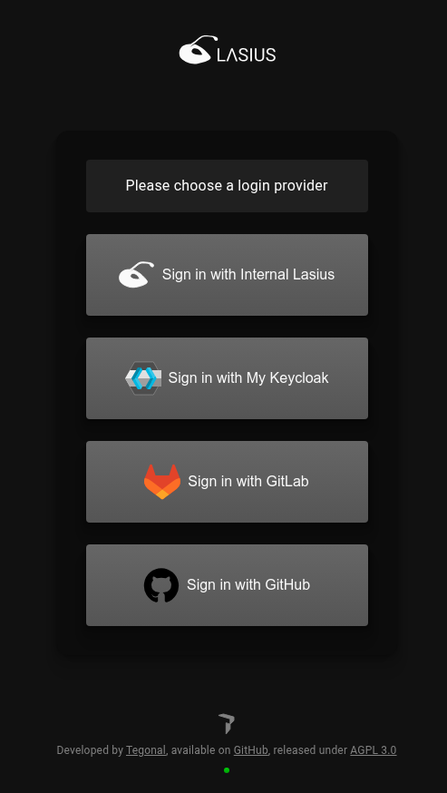
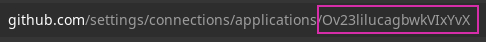

[EN](Auth.md)

# Authentisierung (Anmeldung)

Lasius unterstützt eine [OAuth2](https://auth0.com/de/intro-to-iam/what-is-oauth-2) und [OpenId Connect](https://openid.net/developers/how-connect-works/) basierte Authentisierung der Benutzer, damit Lasius mit bestehenden Identity Provider (IDP) betrieben werden kann und dabei Single-Sign-On oder Machine-2-Machine communcation unterstützt.

Lasius unterstützt konfiguratorisch unterschiedliche Authentication Providers. Werden mehrere Authentication Providers konfiguriert, werden diese dem Benutzer zur Auswahl angezeigt, wird nur ein Authentication Provider konfiguriert, wird der Benutzer automatisch auf die entsprechende Anmelde-Maske weitergeleitet.

### Konfiguration

Die zur Verfügung stehenden Authentication Providers müssen sowohl im Frontend, als auch im Backend aktiviert werden, insofern eine Anmeldung über das Lasius Frontend zur Verfügung stehen soll. 

#### Backend Konfiguration

Die vom Backend zugelassenen Providers müssen in der Backend-Konfiguration unter dem Property `lasius.security. external-issuers` erfasst werden. Als Ausgangspunkt stehen alle bisher zur Verfügung stehenden Anbieter in der Konfiguration `all_providers.conf` exemplarisch zur Verfügung gestellt. Es wird aber empfohlen, diese Konfiguration je nach Anwendungsfall zu kopieren und nur die Anbieter zu führen, über welche eine Anmeldung auch erlaubt sein soll.
Die Anbieter-Spezisichen Credentials werden über entsprechende Umgebungsvariablen bereitgestellt.

#### Frontend Konfiguration

Im Frontend werden die zur Verüfung stehenden Authentication Providers automatisch aktiviert, wenn die entsprechenden Umgebungsvariablen beim Starten des Frontends zur Verfügung stehen.
Bei der Beispiel Backend-Konfiguration wurde darauf geachtet, dass die Anbieter ebenfalls über dieselben Umgebungsvariablen konfiguriert werden, so dass dieselbe `.env` Datei sowohl für das Backend, wie auch für das Frontend verwendet werden kann.

## Providers

### Lasius interner OAuth2 Provider

> Diese IDP ist aber nur für Entwicklungs- und Demo-Umgebungen gedacht

Damit aber für einfache Installationen, zu Demo-Zwecken und für die Entwicklungsumgebung kein IDP bereitgestellt werden muss, bietet Lasius eine OAuth2 basierte einfache Implementierung eines IDP an.

Der interne OAuth2 Provider kann entweder mittels Umgebungsvariablen oder mit einer separaten Backend-Konfiguration aktiviert und konfiguriert werden. Für das Frontend müssen lediglich `LASIUS_OAUTH_CLIENT_ID` und `LASIUS_OAUTH_CLIENT_SECRET` definiert werden, damit der Provider in der Liste der Authentication Provider erscheint.

#### Konfiguration

| Umgebungsvariable | Beschreibung |
|---|--|
| LASIUS_OAUTH_PROVIDER_ENABLED              | Aktivieren oder deaktivieren des internen OAuth2 Providers |
| LASIUS_OAUTH_PROVIDER_ALLOW_REGISTER_USERS | Ermöglicht das Registrieren von neuen Benutzern auf dem internen OAuth Provider |
| LASIUS_OAUTH_CLIENT_ID | Client ID der Frontend Applikation. Es wird empfohlen, je Anwendungsfall eine eigene id zu verwenden |
| LASIUS_OAUTH_CLIENT_SECRET | Client Secret der Frontend Applikation. Es wird empfohlen, je Anwendungsfall eine eigenes Secret zu verwenden |
| LASIUS_INTERNAL_JWT_PRIVATE_KEY | Schlüssel, welcher für das Signieren des internen JWT Tokens verwendet wird. Es wird empfolgen, je Anwendungsfall einen eigenen Schlüssel zu verwenden |

Weitere Parameter wie Lifespan des JWT Tokens müssen mittels separater Backend-Konfiguration definiert werden. Die entsprechenden Standardwerte in der Sektion `lasius.security.oauth-2-provider` aus der [application.conf](https://github.com/tegonal/Lasius/blob/main/backend/conf/application.conf) Konfiguration können dabei entsprechend überschrieben werden.

### Gitlab

Damit eine Authentisierung via öffentlicher [Gitlab](https://gitlab.com) Instanz oder eine self-hosted Instanz aktiviert werden, muss die Applikation auf der entsprechenden Instanz registriert werden:

https://gitlab.com/-/profile/applications

Die Callback-Url muss wie folgt erfasst werden: `https://<hostname>/api/auth/callback/gitlab`, wobei `<hostname>` mit dem öffentlich erreichbaren Namen der Instanz ersetzt werden muss. Die Applikation benötigt die Scopes `openid`, `profile` und `email`.

Danach kann die Gitlab-Integration über folgende Umgebungsvariablen konfiguriert werden, insofern der Anbieter in der Backend-Konfiguration erfasst wurde:

| Umgebungsvariable | Beschreibung |
|---|--|
| GITLAB_OAUTH_URL (optional) | Url der Gitlab Instanz, welche als Authentication Provider verwendet werden soll |
| GITLAB_OAUTH_CLIENT_ID | Client Id der bei Gitlab registrierten Applikation |
| GITLAB_OAUTH_CLIENT_SECRET | Client secret der bei Gitlab registrierten Applikation |
| GITLAB_OAUTH_INTROSPECTION_PATH (optional) | Pfad für den Introspection Endpoint zur Prüfung des Access Tokens |
| GITLAB_OAUTH_USER_INFO_PATH (optional) | Pfad für das Laden des Benutzerprofils |

### Github

Für die Integration von [Github](https://github.com) als Authentication Provider muss die OAuth Applikation bei github erfasst werden:

https://github.com/settings/developers

Die Callback-Url muss wie folgt erfasst werden: `https://<hostname>/api/auth/callback/github`, wobei `<hostname>` mit dem öffentlich erreichbaren Namen der Instanz ersetzt werden muss.

Danach kann die Github-Integration über folgende Umgebungsvariablen konfiguriert werden, insofern der Anbieter in der Backend-Konfiguration erfasst wurde:

| Umgebungsvariable | Beschreibung |
|---|--|
| GITHUB_OAUTH_CLIENT_ID | Client Id der bei Github registrierten Applikation |
| GITHUB_OAUTH_CLIENT_SECRET | Client secret der bei Github registrierten Applikation |
| GITHUB_OAUTH_APPLICATION_ID | Id der bei Github registrierten Applikation. Diese ID muss aus dem URL-Pfad in der Detailansicht der Applikation gelesen werden, bspw.:   |

### Keycloak

Lasius unterstützt die Integration einer [Keycloak](https://keycloak.org) Instanz als Authentication Provider. Dazu muss in der Keycloak Instanz ein entsprechender [OpenID Connect Client](https://www.keycloak.org/docs/latest/server_admin/index.html#_oidc_clients) registriert werden. 

Die Callback-Url muss wie folgt erfasst werden: `https://<hostname>/api/auth/callback/custom_keycloak`, wobei `<hostname>` mit dem öffentlich erreichbaren Namen der Instanz ersetzt werden muss.

Danach kann die Keycloak Instanz über folgende Umgebungsvariablen konfiguriert werden, insofern der Anbieter in der Backend-Konfiguration erfasst wurde:

| Umgebungsvariable | Beschreibung |
|---|--|
| KEYCLOAK_OAUTH_URL | Url der Keycloak Instanz |
| KEYCLOAK_OAUTH_CLIENT_ID | Client Id der registrierten Applikation |
| KEYCLOAK_OAUTH_CLIENT_SECRET | Client secret der registrierten Applikation |

Zusätzlich kann die Integration im Frontend über folgende Umgebungsvariabeln individualisiert werden:
| Umgebungsvariable | Beschreibung |
|---|--|
| KEYCLOAK_OAUTH_PROVIDER_NAME | Name in der Liste der Authentication Providers |
| KEYCLOAK_OAUTH_PROVIDER_ICON | Pfad auf ein spezifisches Icon. Dieses muss im Frontend eingebunden werden, entweder durch einen eigenen Build oder durch das Einbinden einer lokalen Datei beim Starten eines Docker Images |

