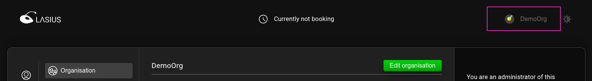
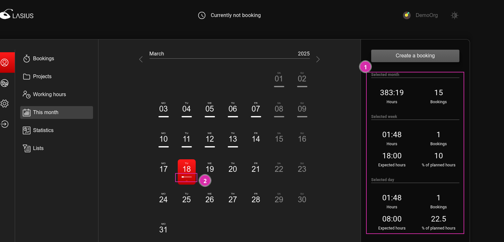

[EN](Organizations)

# Organisationen

Lasius ermöglicht das Erfassen von Zeitbuchungen einer Person in mehreren Organisationen. Eine Organisation kann dabei ein Team, eine Organisationseinheit in einer Unternehmen, ein Unternehmen oder eine sonstige Gruppierung abbilden. Diese soll das Zusammenarbeiten in einer Gruppierung unabhängig von einem spezifischen Projekt ermöglichen.

## Rollen und Berechtigungen für Organisationen

In einer Organisation bestehen die Rollen `Member` und `Administrator`. Benutzer mit der Rolle `Member` stehen dabei folgende Funktionen zur Verfügung:

- Wechseln der Organisation
- Erfassen und verwalten eigener Zeitbuchungen innerhalb dieser Organisation

Ein `Administrator` besitzt zudem folgende _zusätzlichen_ Funktionen:

- Verwalten der Mitgliedschaften in einer Organisation
- Verwalten der Projekte in einer Organisation
- Einsehen und exportieren der Zeitbuchungen und Statistiken aller Benutzer, welche innerhalb dieser Organisation erstellt wurden

## Persönliche Organisation

Jeder Benutzer wird bei der ersten Anmeldung an einer Lasius-Instanz automatisch einer persönlichen Organisation zugewiesen. Diese dient dazu, dass bereits ohne Konfiguration eigene Zeitbuchungen erfasst und mit Lasius gearbeitet werden kann.

ℹ️ Einer persönlichen Organisation können keine weiteren Benutzer beitreten. Für die Zusammenarbeit in einer Organisation muss dazu eine entsprechende neue Organisation erstellt werden.

## Organisation verwalten

Unter dem Menupunkt Organisationen kann eine neue Organisation erstellt werden (1).

Der Benutzer, welcher eine Organisation erstellt, wird dieser automatisch mit der Rolle `Administrator` zugewiesen. Somit können dieser Organisation weitere Benutzer hinzugefügt werden, indem Einladungen mit der gewünschten Rolle erstellt werden (2).

Der Organisations-Name kann zu einem späteren Zeitpunk mittels `Edit Organisation` (3) angepasst werden.

### Benutzer einladen

Ein Benutzer kann nur mittels Einladung zu einer Organisation hinzugefügt werden. Dabei stellt Lasius einen Link auf die Einladung zur Verfügung, welche der eingeladenen Person zur Verfügung gestellt werden muss.

Mit diesem Link gelangt der Benutzer zu einer Login Maske, bei welcher sich der Benutzer anmelden, oder zuerst registrieren muss.

Nach erfolgreicher Anmeldung kann der Benutzer die Einladung akzeptieren oder ablehnen.

Nach dem Beitreten steht die Organisation dem Benutzer zur Auswahl zur Verfügung.

### Organisation wählen

Ein eingeloggter Benutzer erfasst und verwaltet seine Zeitbuchungen immer im Kontext einer Organisation, auch wenn es sich hierbei um die vorher erwähnte persönliche Organisation handelt. Die aktuell ausgewählte Organisation ist für den Benutzer ersichtlich.

Mittels Klick auf die Organisation kann der Benutzer zu einer ihm zur Verfügung gestellten Organisation wechseln und dort seine Zeitbuchungen erfassen.

## Geplante Arbeitszeiten

Ein Benutzer kann unter `Working hours` seine geplanten Arbeitszeiten je zugewiesener Organisation erfassen. Diese Zeiten werden dazu verwendet, um den Fortschritt der Zeitbuchungen in Bezug auf die geplanten Arbeitszeiten zu visualisieren. In einem geplanten späteren Featuren sollen damit auch einfacher Abwesenheiten erfasst werden können.

Die eingetragenen geplanten Arbeitszeiten dazu, das Arbeits-Soll in Form einer Forschritts darzustellen.

Zudem wird unter `This Month` eine Zusammenfassung der Soll-Arbeitsstunden in Form von Statistiken (1) oder als Fortschrittsanzeige je Tag (2) zur Verfügung gestellt.

