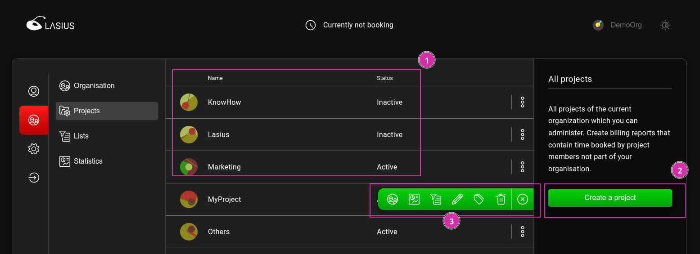
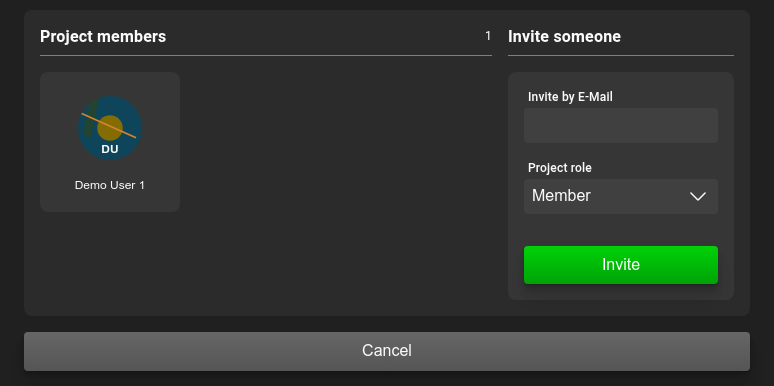
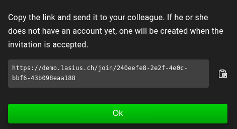

[EN](Projects.md)

# Projekte

Zeitbuchungen werden nebst der [Organisation](DE%3AOrganisations.md) ebenfalls einem Projekt zugeordnet. Ein Projekt besteht dabei lediglich aus einer frei wählbaren Bezeichnung.

## Rollen und Berechtigungen

In einer Organisation bestehen die Rollen `Member` und `Administrator`. Benutzer mit der Rolle `Member` stehen dabei folgende Funktionen zur Verfügung:

- Erfassen und verwalten eigener Zeitbuchungen innerhalb dieses Projektes
- Verlassen des Projektes

Ein `Administrator` besitzt zudem folgende *zusätzlichen* Funktionen:

- Verwalten der Mitgliedschaften innerhalb des Projektes
- Einsehen und exportieren der Zeitbuchungen und Statistiken aller Benutzer, welche innerhalb dieses Projektes erstellt wurden

## Zugewiesene Projekte verwalten

Die einem Benutzer zugewiesenen Projekte stehen einerseits in der Auswahlliste beim Erfassen einer Zeitbuchung zur Verfügung:

Die Liste der zugewiesenen Projekte kann zudem unter dem Menupunkt `Project` eingesehen und verwaltet werden (1).

Mittels Aktion (2) kann ein Projekt verlassen werden. Das Projekt erscheint danach nicht mehr in der Liste der Projekte für neue Zeitbuchungen, bestehende Zeitbuchungen bleiben aber erhalten.

ℹ️ Das Projekt kann als Administrator nur verlassen werden, wenn vorgängig ein anderer Benutzer als Administrator zugewiesen wurde.

Besitzt der Benutzer in der aktuell ausgewählten Organisation der Rechte zum Erfassen von neuen Projekten, steht ihm zudem eine entsprechende Aktion (3) zur Verfügung.

## Projekte in einer Organisation verwalten

Als Administrator einer Organisation können sämtliche der Organisation zugeordneten Projekte zur Verwaltung zur Verfügung. Dazu wird unter der Menüpunkt der `Organisation` eine Liste der Projekte angezeigt (1). Dieses kann von der Liste der eigenen Projekte abweichen, wenn der aktuelle Benutzer nicht allen Projekten der Organisation beigetreten ist.

Der Administrator kann in dieser Ansicht ebenfalls neue Projekte für diese Organisation erstellen (2).
Weitere Aktionen werten im Menu (3) angeboten und umfassen (von rechts nach links):
1. Projekt deaktivieren
2. [Tag und Tag Gruppen Zurordnung des Projektes bearbeiten](DE%3ATags.md#erfassen-von-tags-und-tag-gruppen)
3. Exportieren aller Zeitbuchungen der Organisation
4. Anzeigen der Organisations-Statistiken (Noch nicht implementiert)
5. [Mitgliedschaft der Organisation verwalten](#benutzer-einladen)

### Benutzer einladen

Weitere Benutzer innerhalb oder ausserhalb der zum Projekt gehörenden Organisation können mittels Eingabe der Email-Adresse eingeladen werden.

Lasius erstellt einen Einladungs-Link, welcher dem neuen Benutzer zugestellt werden muss.

Nach erfolgreicher Anmeldung kann der Benutzer die Einladung akzeptieren oder ablehnen. Handelt es sich um einen Benutzer, welcher nicht zu aktuellen Organisation gehört, muss dieser auswählen, zu welcher Organisation der eingeladenen Benutzers das Projekt hinzugefügt werden soll.

#### Externe Benutzer des Projektes

Wird ein Benutzer einer anderen Organisation zu einem Projekt hinzugefügt, dann gilt:

- Der Benutzer sieht das Projekt in seinen [zugewiesenen Projekten](#zugewiesene-projekte-verwalten) und kann darauf eigene Zeitbuchungen verwalten
- Die Zeitbuchungen dieses Benutzers werden bei den Projekt-Zeitbuchungen (Export und Statistiken) ebenfalls berücksichtigt
- Die Zeitbuchungen dieses Benutzers und Projektes sind in den Organisations-Zeitbuchungen des Benutzers ersichtlich
- Die Zeitbuchungen dieses Benutzers sind in den Organisations-Zeitbuchungen des Projektes **nicht** ersichtlich
