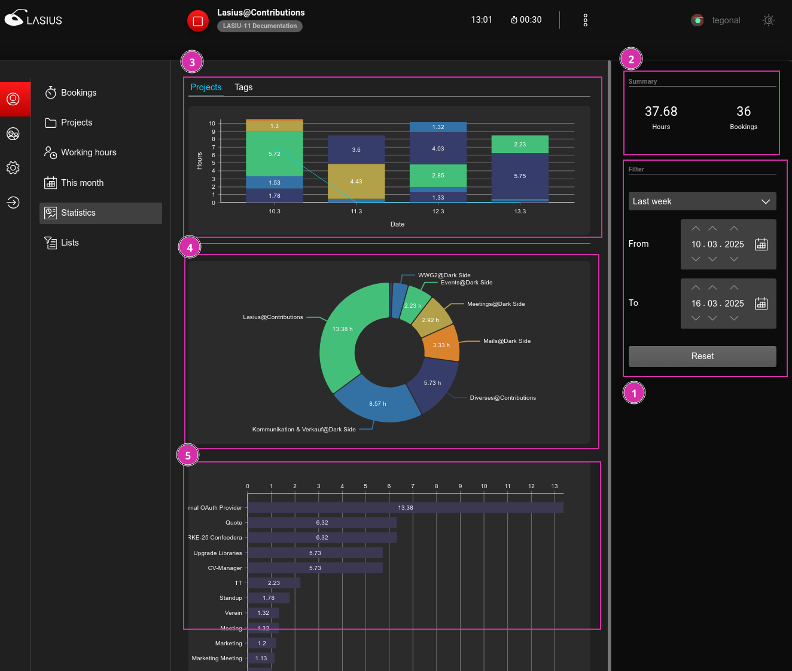
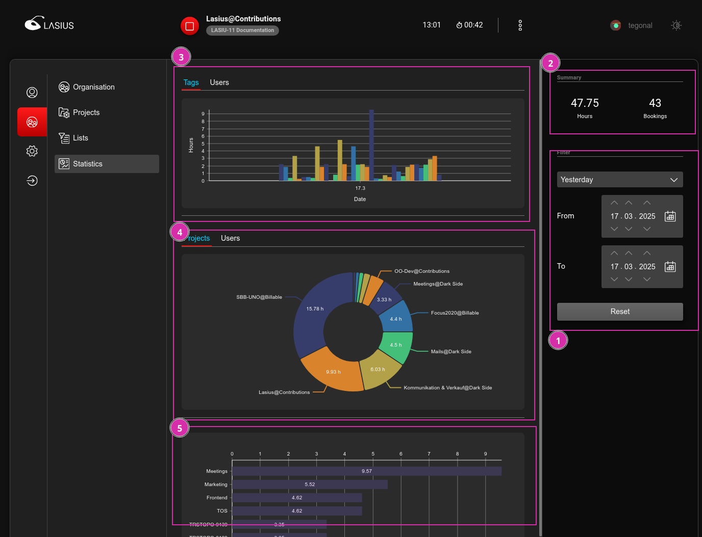

[EN](Statistics.md)

# Statistiken und Exporte

Ein integraler Bestandteil von Lasius sind einfach zugängliche Statistiken und Exporte von Zeitbuchungen für das weiterverarbeiten in Drittsystemen oder dem manuellen Controlling.

Die Statistiken werden dabei zur optimalen Performance vorberechnet vom Lasius Backend zur Verfügung gestellt.

## Perspektiven

Eine Zeitbuchung wird immer den folgenden vier Einheiten zugeordnet:

- Einen Benutzer
- Einer Organisation
- Einem Projekt
- Ein oder mehreren Tag und/oder Tag-Gruppen

Auf Basis dieser Einheiten stehen dem Benutzer je nach Rolle innerhalb des Projektes oder der Organisation verschiedene Ansichten und Exporte auf die Zeitbuchungen zur Verfügung.

### Statistiken

#### Benutzer

Jeder Benutzer kann seine eigenen Zeitbuchungen einsehen und exportieren.

1. Mittels einfachem Filter können die anzuzeigenden Statistiken gefiltert werden.
2. Total der Zeitbuchungen
3. Zeitlicher Verlauf der Zeitbuchungen, gruppiert nach Projekten oder [Tags](#tags)
4. Aggregiert und grupperte Zeitbuchungen nach Projekten
5. Aggregierte Zeitbuchungen nach [Tags](#tags)

#### Organisation

Die Statistiken der Organisation beinhalten alle Zeitbuchungen, welche im Kontext der ausgewählten Organisation erfasst wurden. Dies beinhaltet auch Zeitbuchungen von Projekten, welche von einer anderen Organisation mit [einem Benutzer dieser Organisation geteilt](DE%3AProjects.md#benutzer-einladen) wurden.

1. Mittels einfachem Filter können die anzuzeigenden Statistiken gefiltert werden.
2. Total der Zeitbuchungen
3. Zeitlicher Verlauf der Zeitbuchungen, gruppiert nach [Tags](#tags) oder Benutzer
4. Aggregiert und grupperte Zeitbuchungen nach Projekten oder Benutzer
5. Aggregierte Zeitbuchungen nach [Tags](#tags)

#### Projekte

Die Projekt-Statistiken stehen als vorberechnete Daten mittels API im Lasius-Backend zur Verfügung, werden aber derzeit aber noch nicht in der Web-Applikation angeboten.

#### Tags

Statistiken nach [Tags](DE%3ATags.md) zeigen aggregierte Werte der Zeitbuchungen nach den zugeordneten `Tags`. Da eine Zeitbuchung einem oder mehreren Tags/Tag-Gruppen zugeordnet werden kann, wir der Wert der Zeitbuchung bei **allen** zugeordneten Tag-Aggregationen berücksichtigt. 

Dies bedeutet, dass die Summe der aggregierten Zeitbuchungen nach Tags *nicht* der Summer aller Zeitbuchungen entspricht, da die gleiche Zeitbuchung mehrfach einberechnet werden kann.

Die Statistiken nach `Tags` sollen lediglich eine Relation zu den einzelnen `Tags` untereinander aufzeigen (bspw. `Verrechnbar` vs. `Nicht verrechenbar`)

### Exporte

Basierend auf den Rohdaten stehen nach den Perspektiven Benutzer, Organisation und Projekt CSV-Exporte der Zeitbuchungen mit unterschiedlichen Filtern zur Verfügung. Diese können insbesondere für die Weiterverarbeitung in Drittsystemen verwendet werden.