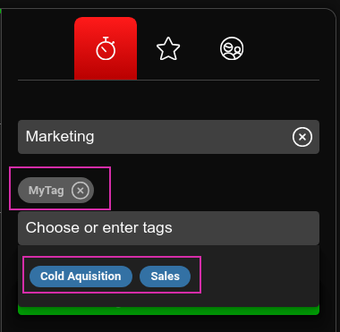
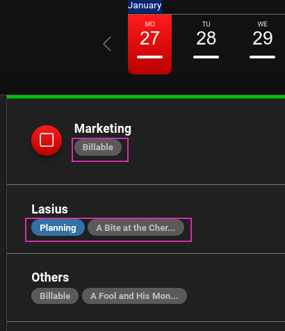
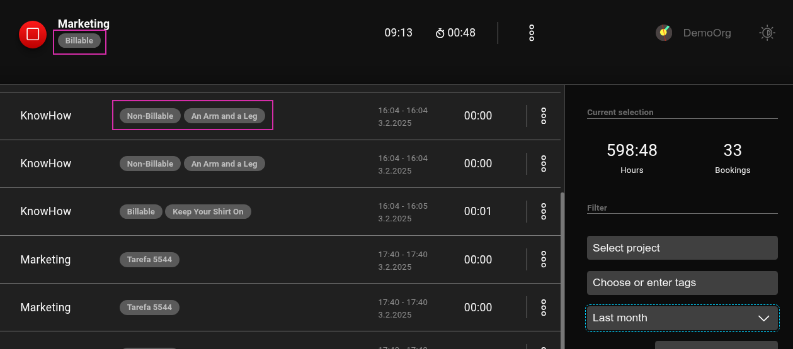
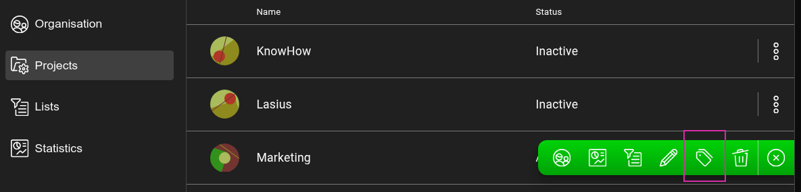
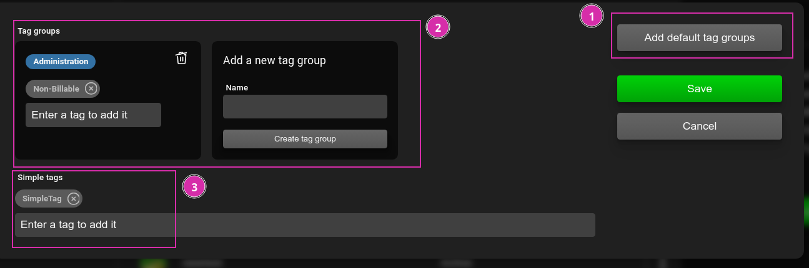

[EN](Tags)

# Tags und Tag-Gruppen

## Erstellen von Zeitbuchungen mit Tags

Zeitbuchungen können mit keinem, einem oder mehreren `Tags` erstellt werden. Tags sollen dabei helfen, eine Zeitbuchung zu identifizieren aber auch mehrere Zeitbuchungen einander zuordnen zu können.

Beim Erfassen einer Zeitbuchung können entweder manuelle Tags erstellt werden, indem im entsprechenden Eingabefeld ein Text eingetragen wird, oder ein dem ausgewählten Projekt zugewiesenen Tag ausgewählt wird.

Die Liste der Verfügbaren Tags kann auch mittels Unten-Pfeiltaste oder der Leertaste geöffnet werden.

_Wir beim manuellen Erfassen der gleiche Text als Tag eingegeben, wird dies als gleiches Tag identifiziert._

Durch das Konfigurieren einer [Integration](DE%3AIntegrations) können zudem automatisch Tags aus einer Drittapplikation wie Gitlab, Plane oder Jira zur Auswahl zur Verfügung gestellt werden. Bei extern definierten Tags wird zudem ein Link hinter dem Tag hinterlegt, so dass beim Klicken in die entsprechende Applikation referenziert werden kann.

## Nutzen von Tags

Die den Zeitbuchungen zugeordneten Tags sind bei der aktuellen Zeitbuchungen und den Vergangenen Zeitbuchungen in der Liste ersichtlich.

Andererseits werden die Tags auch dazu genutzt, um Zeitbuchungen in den [Statistiken](DE%3AStatistis.md#Tags) automatisch zu gruppieren und so einen schnellen Überblick über Zeitbuchungen zur Verfügung zu stellen.

## Tag-Gruppen

Tag-Gruppen ist, wie der Name bereits aussagt, eine Gruppierung von mehreren `Tags`, welche zusammengefasst unter einem Namen angezeigt werden. In der Auswahlliste der zur Verfügung stehenden Tags sowie in der Listen der Zeitbuchungen werden Tag-Gruppen nur unter dem Gruppen-Namen angezeigt.

Die entsprechende Zugewiesene Zeitbuchung wird dabei aber automatisch allen in der Tag-Gruppe inkludierten `Tags` zugewiesen, so dass diese in den [Statistiken](DE%3AStatistis.md#Tags) bei allen `Tags` berücksichtigt werden.

Ein kleines Beispiel soll dies Verdeutlichen. Es werden zwei Tag-Gruppen `Kundenprojekte` und `Support` erfasst. Beiden Tag-Gruppen wird das Tag `Verrechenbar`und weitere Tags hinzugefügt. Zeitbuchungen beider Tag-Gruppen werden dabei automatisch dem Tag `Verrechenbar` zugewiesen.

## Erfassen von Tags und Tag-Gruppen

Tags und Tag-Gruppen können als Organisations-Administrator unter dem Menupunkt `Projects` erfasst und bearbeitet werden.

Dabei können:

1. Ein Standardset von Tag-Gruppen einem Projekt zugewiesen werden
2. Tag-Gruppen manuell erstellt, gelöscht oder bearbeitet werden
3. Einzelne Tags erstellt oder gelöscht werden

