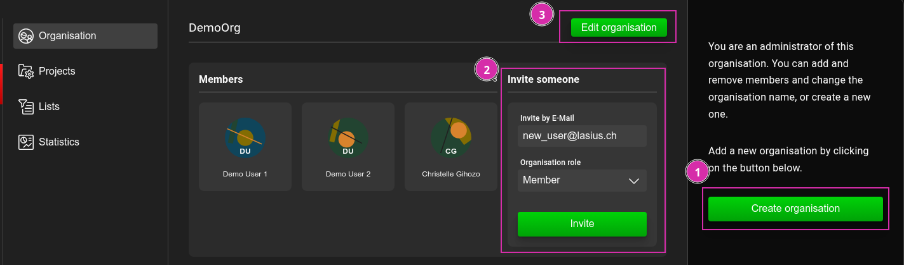
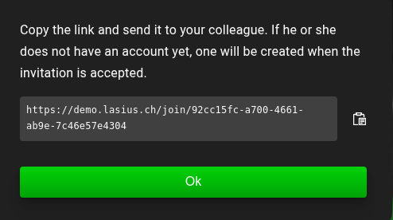
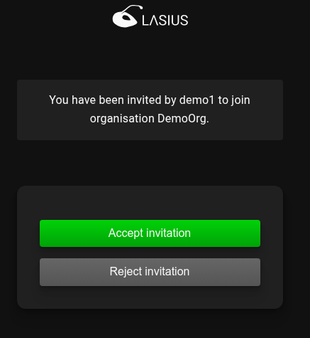
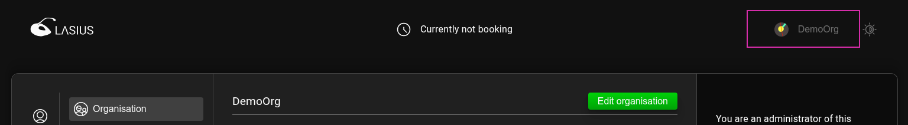
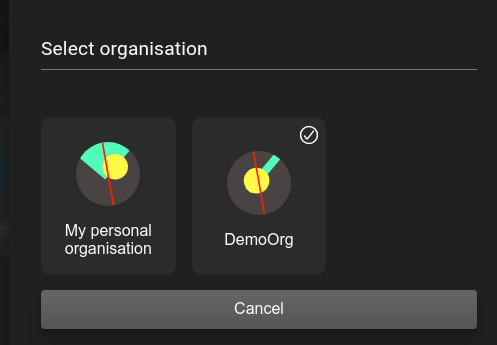
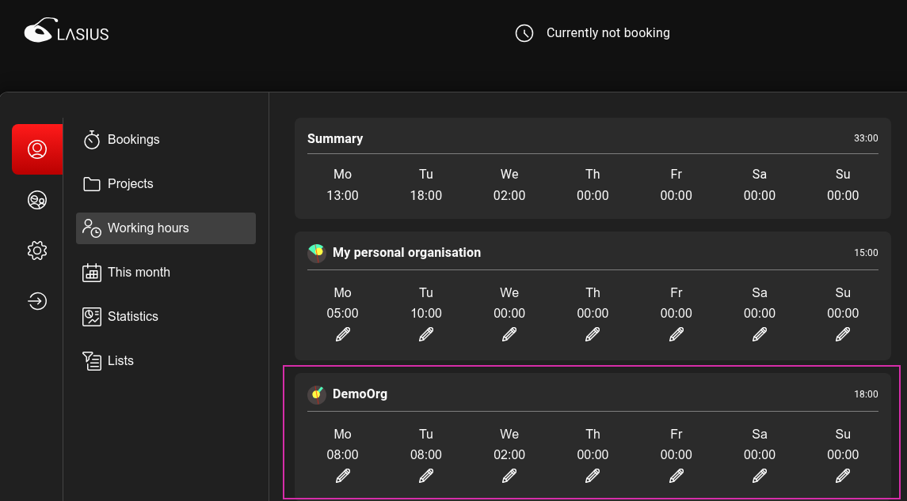
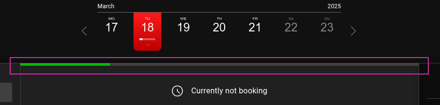

[DE](DE%3AOrganizations.md)

# Organisations

Lasius enables users to record time bookings across multiple organizations. An organization can represent a team, a department within a company, a company, or any other grouping. This allows collaboration within a group independent of a specific project.

## Roles and permissions

Within an organization, there are two roles: `Member` and `Administrator`. Users with the `Member` role have access to the following functions:

- Switching between organizations
- Recording and managing their own time bookings within the organization

An `Administrator` has additional functions:

- Managing memberships within the organization
- Managing projects within the organization
- Viewing and exporting time bookings and statistics for all users within the organization

## Personal organization

Every user is automatically assigned to a personal organization upon their first login to a Lasius instance. This allows users to start recording time bookings and working with Lasius without requiring configuration.

ℹ️ A personal organization cannot have additional members join. To collaborate within an organization, a new organization must be created.

## Managing organizations

Under the "Organizations" menu item, a new organization can be created (1).
The user who creates an organization is automatically assigned the `Administrator` role, allowing them to add more users to the organization by creating invitations with the desired role (2).
The organization name can be changed later using the `Edit Organization` option (3).

### Inviting users

A user can only be added to an organization via invitation. Lasius provides a link to the invitation, which must be made available to the invited person.

Using this link, the user is directed to a login screen, where they can log in or register if necessary.

After successful login, the user can accept or decline the invitation.

After joining, the organization becomes available to the user.

### Selecting an organization

A logged-in user always records and manages their time bookings within the context of an organization. The currently selected organization is visible to the user.

By clicking on the organization, the user can switch to another available organization and record time bookings there.

## Planned working hours

A user can record their planned working hours per assigned organization under `Working hours`.

The recorded planned working hours are used to display the work schedule as a progress chart.

Additionally, under `This Month`, a summary of scheduled working hours is provided in the form of statistics (1) or a small progress indicator per day (2).

