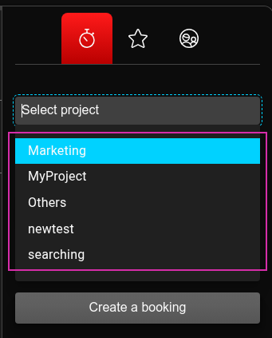
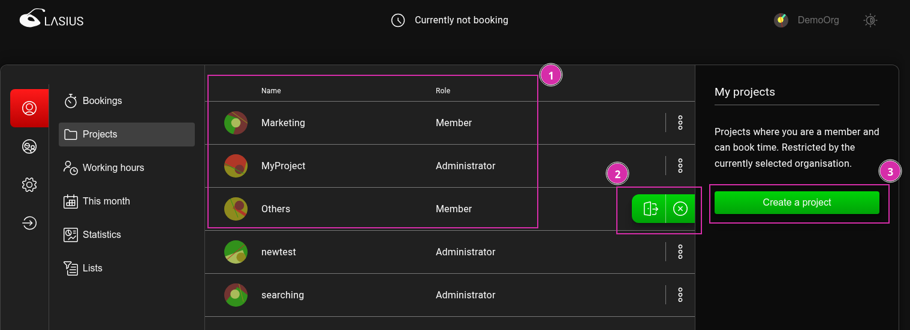
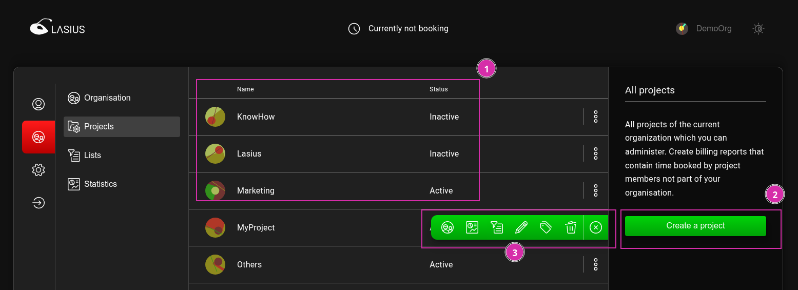
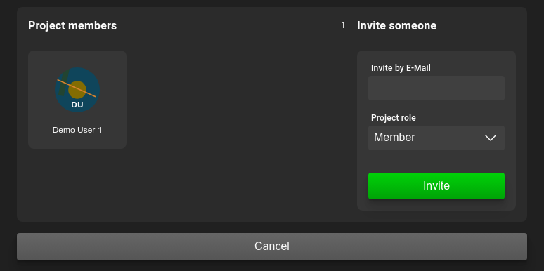
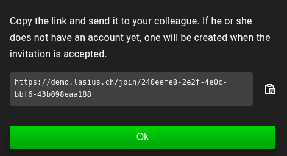
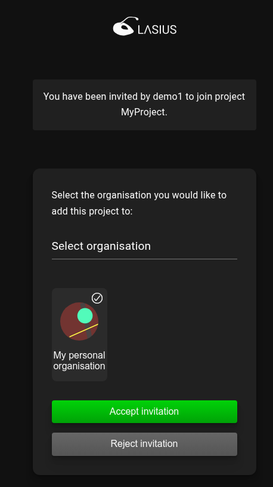

[DE](DE%3AProjects)

# Projects

Time bookings are associated not only with an [organization](Organisations) but also with a project. A project consists simply of a freely chosen designation.

## Roles and permissions for projects

Within an organization, there are two roles: `Member` and `Administrator`. Users with the `Member` role have access to the following functions:

- Record and manage their own time bookings within this project
- Leave the project

An `Administrator` has the following additional functions:

- Manage memberships within the project
- View and export time bookings and statistics for all users who have created them within this project

## Managing assigned projects

The projects assigned to a user are available in the selection list when recording a time booking:

The list of assigned projects can also be viewed and managed under the Project menu item (1).

Using the action (2), a project can be left. After leaving, the project will no longer appear in the list of projects for new time bookings, but existing time bookings will remain intact.

ℹ️ As an administrator, a project can only be left if another user has previously been assigned as an administrator.

If the user has the rights to create new projects in the currently selected organization, they will also have access to a corresponding action (3).

## Managing projects in an organization

As an administrator of an organization, you can manage all projects associated with the organization. Under the Organization menu item, a list of projects is displayed (1). This list may differ from the list of your own projects if you are not a member of all projects in the organization.

In this view, the administrator can also create new projects for this organization (2).
Additional actions are offered in the menu (3) and include (from right to left):

1. Deactivate project
2. [Edit project tag and tag group assignment](Tags.md#managing-tags-and-tag-groups)
3. Export all time bookings for the organization
4. Display organization statistics (Not yet implemented)
5. [Manage organization membership](#inviting-users)

### Inviting users

You can invite additional users within or outside the organization associated with the project by entering their email address.

Lasius generates an invitation link that must be sent to the new user.

After successful login, the user can accept or decline the invitation. If the user does not belong to the current organization, they must select which organization the invited user's project should be added to.

#### Users of projects from other organizations

When a user from another organization is added to a project, the following applies:

- The user sees the project in their [assigned projects](#managing-assigned-projects) and can manage their own time bookings for it
- The user's time bookings are included in the project's time bookings (export and statistics)
- The user's time bookings for this project are visible in the user's organization time bookings
- The user's time bookings are **not** visible in the project's organization time bookings
