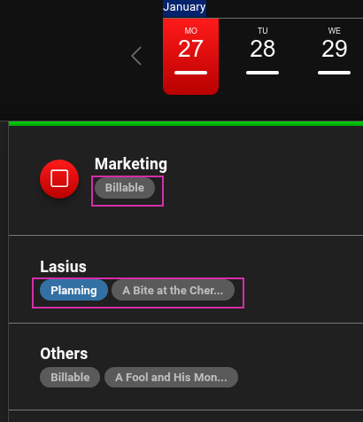
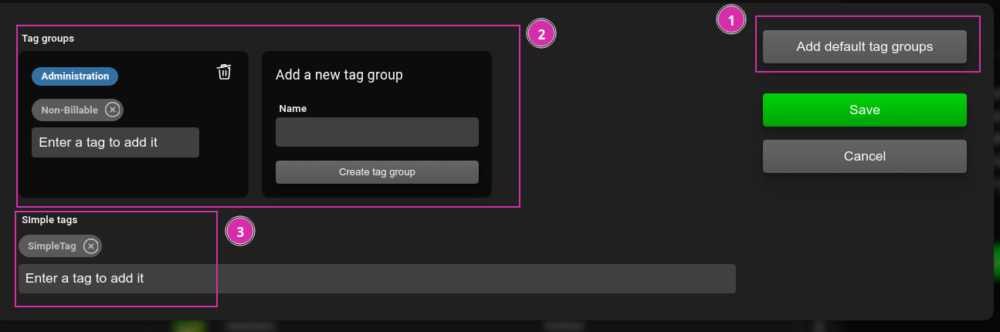

[DE](DE%3ATags)

# Tags and Tag-groups

## Creating time bookings with tags

Time bookings can be created with or without `tags`. When used, tags help identify a time booking and can also be used to associate multiple time bookings with each other.

When recording a time booking, either manual tags can be created by entering text in the corresponding input field, or a tag assigned to the selected project can be chosen.

The list of available tags can also be opened using the down arrow key or the space bar.

_If the same text is entered as a tag when manually recording, it will be identified as the same tag._

By configuring an [integration](Integrations), tags can also be automatically imported from a third-party application like Gitlab, Plane, or Jira, making them available for selection. For externally defined tags, a link is also stored behind the tag, allowing reference to the corresponding application when clicked.

## Benefits of tags

The tags assigned to time bookings are visible in the current time bookings and past time bookings in the list.

On the other hand, tags are also used to automatically group time bookings in the [statistics](Statistics.md#tags), providing a quick overview of time bookings.

## Tag groups

A tag group is, as the name suggests, a grouping of multiple `tags` that are displayed together under a single name. In the selection list of available tags and in the list of time bookings, tag groups are only displayed under the group name.

However, the corresponding time booking is automatically assigned to all tags included in the tag group, so that they are taken into account in the [statistics](Statistics.md#tags) for all tags.

A small example should illustrate this. Two tag groups `Customer Projects` and `Support` are recorded. Both tag groups include the tag `Billable` and additional tags. Time bookings for both tag groups are automatically assigned to the tag `Billable`.

## Managing tags and tag groups

Tags and tag groups can be managed by an organization administrator under the `Projects` menu item.

Here, you can:

1. Assign a standard set of tag groups to a project
2. Manually create, delete, or edit tag groups
3. Create or delete individual tags

